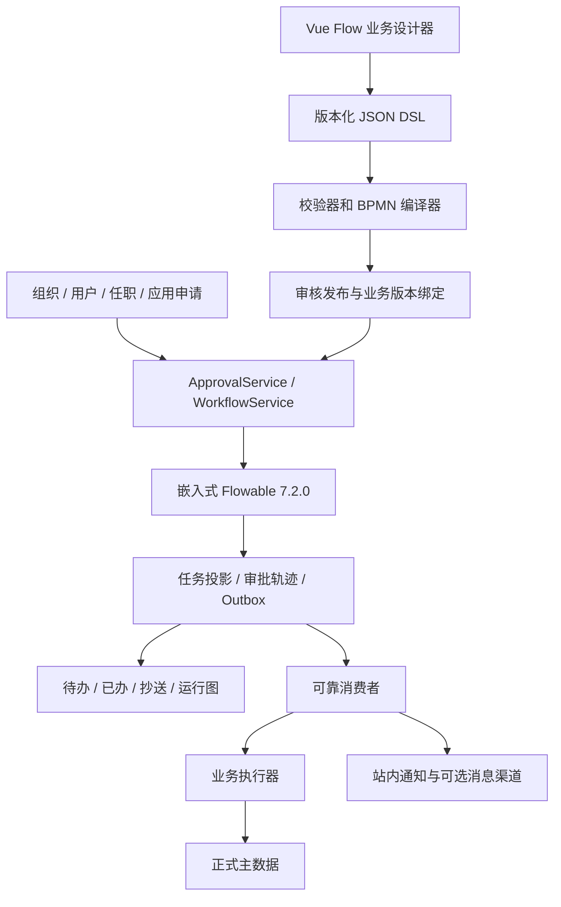
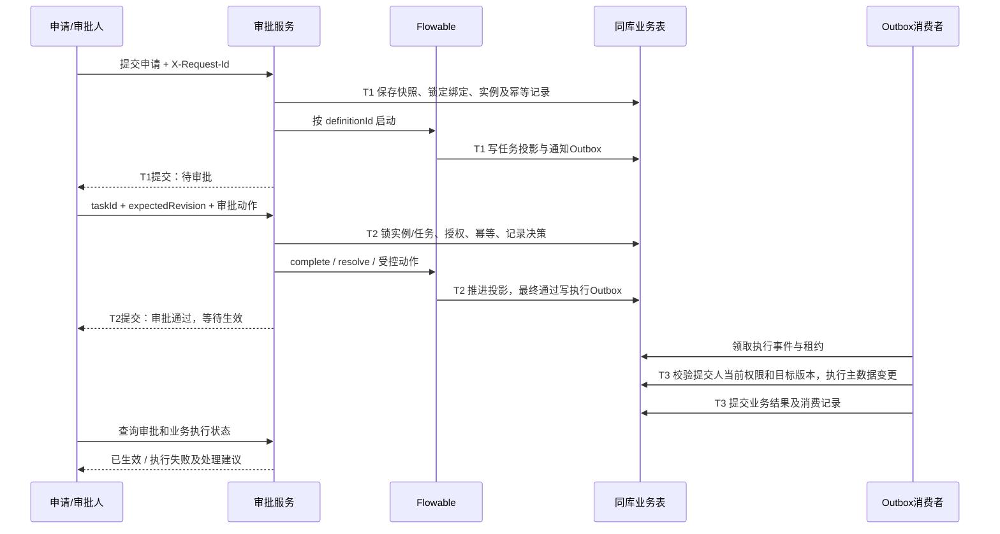
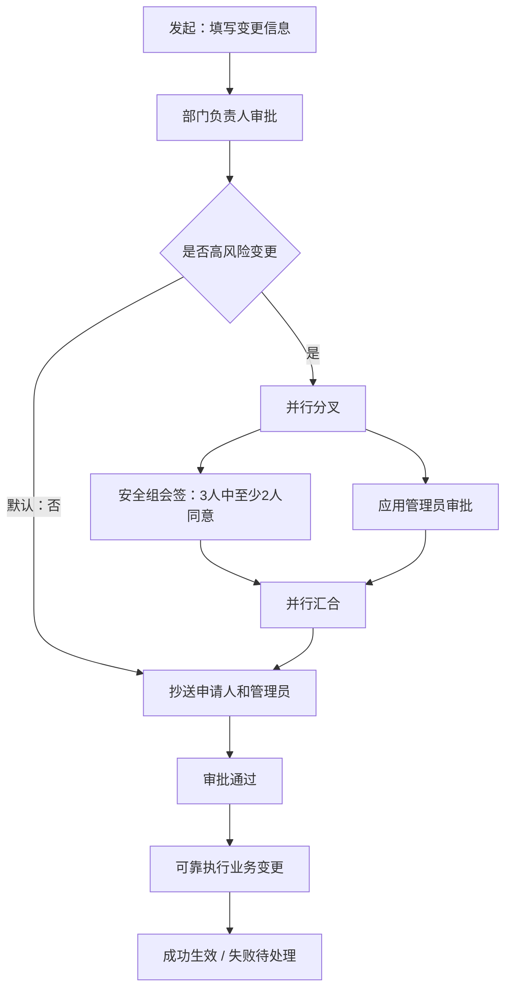

## Context

本方案回答“业务管理员怎样自己画审批流程，并把画出的流程安全地用于实际审批”。目标读者为流程管理员、前后端开发、测试与运维；以下为待实施设计，不代表已经上线。

### 现有基础与实际缺口

2026-09-04 读取工作树发现已有大量未提交的流程开发内容；这里只记录读取时的快照，不覆盖既有工作。

| 范围 | 已见代码或配置 | 本方案补齐内容 |
| --- | --- | --- |
| 技术栈 | Java 21、Boot 3.5.16、Flowable 7.2.0；schema-update=false、async=true、history=audit | 目标 MySQL 5.7 的真实集成验证、运行配置与恢复演练 |
| 引擎 | WorkflowService、FlowableWorkflowService、任务/记录/候选人/幂等表 | 复杂操作语义、竞争处理、可靠终态联动 |
| 设计后端 | 四类节点 DSL、编译校验、保存/发布/启停/版本接口 | 新建/列表/详情、草稿并发控制、试运行、发布审核、业务绑定 |
| 设计前端 | package.json 已有 Vue Flow；api/store/types/校验和节点组件已有部分代码 | 完整页面、画布往返、发布体验、审批中心与运行轨迹 |
| 多人审批 | AND/OR/PERCENT 和一票否决代码；动态加签与退回方法存在 | MI 作用域隔离、真实引擎验证、明确委派归还与分支取消 |
| 身份与权限 | 4A 身份体系；请求 menu 头校验 | 岗位真实解析、接口固定权限、任务参与者范围与身份快照 |
| 业务 | ORG/USER/POSITION/APP 变更申请与同步生效路径 | 版本化业务绑定、异步生效、重试与对账 |

前置 change `workflow-approval-engine` 尚未归档，其 tasks 文件与正在变化的前端工作树不完全一致。实施时先核实完成情况；不能将“方法存在”“任务已打勾”当成生产验收证据。

### 两份参考文档的取舍

| 参考意见 | 本项目决定及理由 |
| --- | --- |
| 第一份主张业务 DSL，第二份主张 bpmn-js | 延续 Vue Flow + DSL，面向业务管理员；不同时维护两套可编辑真相。BPMN 只作为编译产物只读导出 |
| 自有审批表与只查引擎状态存在分歧 | Flowable 掌管执行 token；自有表保存业务状态、任务查询投影和审计，同事务同步并提供对账，不再自行推进流程 |
| 挂起新版本后自动使用旧版本 | 改为业务绑定显式选择旧 definitionId。Flowable 7.2.0 按 key 查最新定义的代码不是“查最新可用版本”契约，不能据此实现回滚 [S1] |
| completed/total 表示同意比例 | completed 是任务完成数量 [S2]；同意票、反对票单独计数，流程终止拒绝与普通反对票分开 |
| 结束监听器发 Spring 事件即可 | 数据库 Outbox 是可靠记录；Spring 事件只用于唤醒消费者，丢失唤醒也能轮询恢复 |
| 先做全部引擎能力 | 开放可验证的审批节点集合；复杂跨流程/任意跳转进入后续 change |

## Goals / Non-Goals

**Goals:**

1. 管理员完成“新建 → 画图 → 配人/条件/表单 → 校验 → 试运行 → 审核发布 → 业务绑定”。
2. 使用者完成“填写申请 → 发起 → 待办审批 → 多级流转 → 正式数据生效 → 追溯”。
3. 发布与运行隔离、任务授权准确、重复请求无重复副作用、宕机可恢复、故障可操作。
4. 完成串行审批、会签/或签/比例、结构化条件、配对并行、抄送、定时提醒和白名单自动任务。

**Non-Goals:**

首轮不开放任意 XML 上传、UEL/脚本编辑、任意 Java 类或 URL 节点、包容网关、Call Activity、信号编排、多租户、运行实例迁移、跨并行域退回、减签、非会签动态前后加签。画布中不展示尚未获准的功能；伪造 DSL 也必须拒绝。跨系统复用通过后续适配器扩展，不先拆微服务。

## Decisions

### 1. 模块化单体与责任边界



引擎与 MyBatis 使用同一 DataSource 和 Spring 事务管理器，明确验证连接及回滚行为，不能仅凭同一个数据库名称认为已共用事务。[S3] Controller 保持薄层；新代码沿用 service/impl、dto、entity、mapper、mapstruct 分层。监听器负责投影、记录和 Outbox，不发送网络请求。

ACT_* 属引擎私有表，业务 SQL 不联查或修改它们；查询与修复通过 RepositoryService、RuntimeService、TaskService、HistoryService、ManagementService 适配器完成。官方建表脚本保持供应商结构，自有业务表统一 tab_，不擅自重命名引擎表。取消/结束由引擎 API 或编译后的 BPMN 完成，不手工删除 execution。

### 2. 自己画流程的页面与操作

流程管理列表显示编码、业务类型、草稿修订、生效版本、状态、更新时间；提供新建、编辑、复制、版本、绑定与启停入口。

设计器采用左侧节点工具栏、中间画布、右侧属性面板、底部校验结果：

| 区域 | 用户可操作内容 |
| --- | --- |
| 工具栏 | 开始、审批、条件、并行块、抄送、自动任务、结束 |
| 画布 | 拖拽、连线、删除、复制节点、缩放、撤销重做、自动布局、节点搜索 |
| 审批属性 | 审批人来源、会签策略、通过比例、反对策略、空人策略、自审、操作开关、超时 |
| 条件属性 | 选择字段/操作符/值、AND/OR 条件组、分支优先级、唯一默认分支 |
| 表单属性 | 绑定表单版本、字段隐藏/只读/必填可写、可路由字段标识 |
| 校验/试运行 | 点击错误定位节点；输入模拟表单和身份，展示路径、解析人及未覆盖分支 |
| 顶部动作 | 保存草稿、校验、试运行、提交审核、正式发布、查看只读 BPMN |

并行节点通过“添加并行块”同时生成分叉与汇合，分支在块内编排，降低死锁配置风险。界面保留项目圆点+虚线视觉语言。API 经 api/ 封装，Pinia setup store 保存模型与脏标记。保存包含坐标、视口、节点配置与边；刷新往返不丢业务配置。离开未保存页面提示；只读历史页不写草稿。

允许保存未连完的草稿，保存时只做结构/schema/大小限制；发布才要求完整有效。revision 乐观锁阻止两人静默覆盖；冲突时保留本地未保存副本，显示服务器修订。

### 3. DSL v2 与编译契约

前端 DSL 是唯一可编辑来源；schemaVersion 与流程版本分离。v1 老定义继续使用原编译器和解释规则，不原地升级；编辑旧版复制成 v2 草稿后重校验。保存的业务 JSON 不嵌任意表达式。

以下为最小完整示例，字段为新增 v2 契约，不冒充当前 DTO 已支持：

```json
{
  "schemaVersion": 2,
  "processCode": "USER_CHANGE",
  "processName": "人员变更审批",
  "formVersionId": "701",
  "policies": {"withdraw": "BEFORE_FIRST_DECISION"},
  "nodes": [
    {"id":"start","type":"START","position":{"x":80,"y":160}},
    {"id":"leader","type":"APPROVAL","name":"部门负责人",
     "position":{"x":300,"y":160},
     "assignee":{"type":"APPLICANT_ORG_LEADER","orgSource":"APPLICANT_SNAPSHOT"},
     "vote":{"mode":"ALL","execution":"PARALLEL","rejectPolicy":"VETO"},
     "emptyPolicy":"BLOCK","selfPolicy":"EXCLUDE",
     "actions":{"transfer":true,"delegate":true,"return":false,"addSign":false},
     "timeout":{"duration":"PT48H","action":"REMIND","maxReminders":3},
     "fieldPermissions":{"reason":"READ","riskLevel":"READ"}},
    {"id":"end","type":"END","outcome":"APPROVED","position":{"x":550,"y":160}}
  ],
  "edges":[{"id":"e1","source":"start","target":"leader"},
           {"id":"e2","source":"leader","target":"end"}],
  "layout":{"zoom":1,"x":0,"y":0}
}
```

节点映射：START→StartEvent，APPROVAL→UserTask/MI + 受控决策出口，CONDITION→ExclusiveGateway，PARALLEL_SPLIT/JOIN→成对 ParallelGateway，CC→写抄送与 Outbox 的内部 ServiceTask，AUTO→白名单异步 ServiceTask，END→明确结果的结束事件。普通 END 等待所有正常 token 完成；全流程 REJECT 使用根流程范围的终止结束语义，取消其他开放分支，不把单个分支结束误当流程完成。

条件 AST：`{logic:"AND",items:[{field:"riskLevel",op:"EQ",value:"HIGH"}]}`。字段来自版本化表单白名单；支持 EQ/NE/GT/GE/LT/LE/IN/IS_NULL，按字段类型限定运算；字符串不隐式转数字，金额用十进制定点，日期转换为约定时区的标准值。多个分支命中按稳定 priority 从小到大取第一个，默认分支最后，无默认分支不得发布。不接受 `${...}` 字符串或由用户拼接的 Bean 调用。

表达式只由编译器固定生成，条件使用内部规则 ID 调用受限 evaluator；不把用户值直接拼进 UEL。引擎可见 Bean 限定为工作流白名单；XML 导出只读，禁止把导出修改后直接部署。

发布校验分层：

1. JSON schema：ID 唯一、引用存在、字段类型/长度/节点数/嵌套深度限制；初始建议 200 节点、10 层、1MB，可配置。
2. 图结构：唯一开始、至少一结束、所有节点从开始可达且能达结束、开始无入边、结束无出边、普通节点一条正常出边、无环。退回作为受控命令，不在草稿画任意环。
3. 分支结构：条件分支唯一默认边、priority 唯一；并行块单入口单出口、正确嵌套、禁止跨块连接；条件分支不能缺席汇合。
4. 业务：审批来源/表单字段/岗位/角色存在、动作组合允许、比例和超时范围合法、自动任务 ID 有实现、敏感节点不允许自动通过。
5. 编译后执行 Flowable ProcessValidator；输出错误 `code,nodeId,edgeId,fieldPath,message`。静态合法并不证明业务可运行，继续做真实试运行。

编译产物持久化 DSL 快照、BPMN XML、摘要、节点到 BPMN activityId 映射、compilerVersion、表单版本和规则快照。多实例变量使用节点执行作用域，不能共用根级 approved/approverList/miVeto 污染并行节点。

### 4. 测试、发布与业务绑定

草稿 `EDITING → IN_REVIEW → APPROVED_FOR_RELEASE`，修改内容使审核失效；发布生成新的不可变 definition，不覆盖旧版。模型 `enabled`、草稿状态与版本是否可发起分开，保存草稿不能让正在生效的版本停止接单。

试运行分两层：快速预演给路径和人员解析解释；真实试运行在测试环境的独立数据库/引擎，使用模拟业务 executor、禁用真实通知与外部动作。不能只加一个前端 dryRun 参数就共享生产引擎。试运行报告绑定 DSL/form/compiler 摘要，修改后失效；报告列出测试输入与覆盖路径，未运行分支不声称已验证。

生产发布要求编辑者与发布审核者不是同一人；发布请求携带 expectedRevision、approvedDigest、X-Request-Id。短事务锁模型行、重新校验审核摘要、分配版本、部署、存 definition 与规则快照；任一步失败整体回滚。`(model_id, definition_version)` 唯一兜底，不能无锁 max(version)+1。发布完成后仍需业务绑定才接收实际申请。

新增绑定维度 `(biz_type, operation_type, scope_type, scope_id)`，例如 USER/UPDATE/ORG/100。确定性选择：精确组织 → 最近祖先组织 → 全局；同层同类型唯一，找不到拒绝发起，不偷偷用默认 key。绑定保存 explicit definitionId、executionMode、revision、enabled；全局绑定是管理员明确配置，不是引擎隐式回退。

启动时事务内读取并锁定所选绑定（并与切换绑定使用相同锁顺序），校验模型/绑定启用和 definition 可用，保存 bindingRevision 与 definitionId，再按 Flowable definitionId 启动。旧实例永远使用自己绑定的旧 DSL、表单和规则。

回滚是显式把绑定指向验证过的旧 definitionId，检查表单/执行器兼容性；只影响后续发起。模型下线禁止新发起但不挂起运行中实例。必要时挂起定义使用不级联实例的 API；禁止认为按 key 启动会自动寻找更旧可用版本。[S1]

### 5. 表单、身份及审批人

复用动态字段元数据产生不可变 formVersion，不额外部署 Flowable Form/IDM。申请保存完整业务快照、表单版本、before/after、目标数据 revision/hash、申请人 userId、提交时组织/岗位、schemaVersion；只有路由必须的小型标量传入引擎。凭据、密码、令牌不能进入流程变量或审批快照，敏感更新通过密钥引用/专用安全路径处理。

节点字段规则为 HIDDEN/READ/WRITE_REQUIRED/WRITE_OPTIONAL，后端和 UI 同口径；隐藏字段从响应移除。主数据变更 payload 在发起后冻结，审批节点只能补充意见或独立审批字段，不直接改待生效对象。改变路由或业务 payload 必须撤回/拒绝后新建申请并关联 previousRequestId，不能复用旧审批结论。

审批人类型：固定用户、角色、岗位任职、指定组织负责人、申请人组织负责人、上级负责人、应用管理员、表单引用人员、上一节点处理人、申请人。岗位解析对接真实有效任职关系，不以空实现当“完成”；应用角色没有数据来源则该选项禁用并发布失败，不假定已有字段。组织负责人以明确的管理角色+组织范围解析，不能把所有组织管理员都当负责人。

提交时冻结申请身份上下文；节点激活时按版本化规则查询当时有效审批人，去重、过滤停用/删除身份，保存候选人快照和解析依据。已经生成的任务不因角色新增成员自动扩权；当前处理时再次检查用户有效、审批权限以及仍满足规则资格，离职或失去资格进入异常待处理队列。运维重分配必须留下原候选人、原因、执行者与新候选人。

空人默认 BLOCK，进入可见待分配状态，不自动通过；可配置指定兜底角色，但兜底也为空时仍阻塞。自审默认 EXCLUDE，排除后为空沿用空人策略；显式允许自审需发布审核。连续相同审批人默认仍须逐级处理。并行汇合后的“上一节点处理人”如有多个来源，配置必须指定 sourceNodeId，不能猜一个。

BLOCK 不通过抛异常反复回滚上一节点实现：编译器在每个审批节点前生成受控的“解析 → 是否有人”路径，无人时停在内部等待分配的 ReceiveTask，保存 nodeRun 与异常；有人的路径才创建 UserTask/MI，避免空集合 MI 直接跳过。运维重分配验证并持久化审批人后通过适配器触发该等待执行继续；恢复请求幂等，绑定具体 executionId/nodeRunId。内部等待节点映射回业务审批节点，前端显示“待分配”；图校验规则针对用户 DSL，编译器内部恢复路径不向用户开放。

### 6. 从提交到生效的事务链路



写入口使用 `@Transactional(rollbackFor = Exception.class, propagation = Propagation.REQUIRED)`；独立恢复事务显式配置 REQUIRES_NEW，必须经代理调用。监听器失败不吞异常。最终同步节点与定时器/异步节点都接入同一终态协调器，不仅在 HTTP approve() 返回后检测结束。

状态分开：

| 对象 | 状态 |
| --- | --- |
| 审批实例 | RUNNING → APPROVED / REJECTED / WITHDRAWN / TERMINATED |
| 运维阻塞原因 | 独立 exceptionCode，如 ASSIGNEE_EMPTY、JOB_FAILED；不伪造引擎终态 |
| 业务执行 | NOT_READY → PENDING → EXECUTING → SUCCEEDED / FAILED_RETRYABLE / FAILED_MANUAL |
| 任务 | PENDING / CLAIMED / DELEGATED → APPROVED / DISAGREED / REJECTED / RETURNED / CANCELLED |

拒绝/撤回/终止不产生业务执行事件。流程正常结束必须读取明确的 outcome，不能把“找不到运行实例”推断为通过。节点创建取消、MI 提前结束、转办/委派都同步任务投影；唯一 flowable_task_id 防重。并行当前节点是集合，原 currentNodeName 仅兼容摘要，不能据其定位唯一任务。

业务执行使用业务适配器注册表（ORG/USER/POSITION/APP × operationType），复用既有校验与主数据方法；以提交人的当前业务权限和数据范围重校验，记录提交人、审批人及执行服务身份，finally 清理线程上下文。审批通过不意味着恢复已撤销权限。

本地主数据写入、执行成功记录、消费去重、结果 targetId、后续数据变更 Outbox 在 T3 同事务提交，避免崩溃后重复创建。若目标 revision/hash 已变化、唯一键冲突、权限收紧，标为 FAILED_MANUAL，不盲目覆盖。重新审批新快照才能改变业务内容。暂时性连接/锁超时可按原事件重试；不得让执行器再次经过“提交审批”入口形成递归。

### 7. 会签、并行与动作的精确定义

会签执行方式 execution=PARALLEL/SEQUENTIAL，与投票规则 mode=ALL/ANY/PERCENT 分开；v1 AND/OR/PERCENT 映射为默认一票否决的 v2 规则，旧版本不变。候选池抢办与多人或签不同：前者一项任务+claim，后者每人独立 MI 任务。

每次节点激活生成 nodeRunId，对应 MI body/execution；记录 N 总票数、A 同意票、R 反对票、U=N-A-R。阈值 K：ALL=N，ANY=1，PERCENT=ceil(N×百分比/100)，整数计算。VETO 策略 R>0 即拒绝；THRESHOLD 策略 A≥K 通过、A+U<K 拒绝，其余等待。`DISAGREE` 是 THRESHOLD 反对票；`REJECT` 是节点允许的终止拒绝，必须填意见，不混成一个按钮。只允许在真实任务决策时计票，取消/委派归还不算票。

MI 完成条件只结束本组；取消剩余任务由引擎完成，业务投影记录 CANCELLED+原因，不能作为已同意。所有变量隔离到节点执行/轮次，重入节点重新计票。跨并行分支不会共享批准变量。会签/网关行为依据 [S2]，具体组合须通过 7.2.0 真实引擎测试。

| 动作 | 约定与限制 |
| --- | --- |
| claim/approve | 未分配候选任务原子 claim 后审批；已分配只允许 assignee；操作人从登录上下文读取 |
| reject | 明确全流程终止拒绝；根作用域取消所有开放分支、任务与定时器，保留审计 |
| return | 只退到同一串行域中实际完成且配置可退的节点；拒绝跨并行块/跨MI边界/未经过节点，取消被撤销任务并重建轮次；首轮不开放退回申请表单修改 |
| transfer | 移交当前任务处理权；原人失权，新人重新校验，记录 from/to；不额外增加票数 |
| delegate/resolve | 原处理人为 owner，受托人提交处理意见后 resolve 归还 owner；resolve 不 complete，owner 再决定；禁止未归还直接批准、链式委派 |
| add-sign | 首轮仅开放仍活跃的并行 MI，不能将增加 candidate 当加签；去重，新增真实 MI execution；N 与 K 在同一实例锁内更新并留痕；串行MI/候选池/已结束节点拒绝 |
| withdraw | 仅申请人在没有 APPROVE/DISAGREE/REJECT 决策前可撤回；与首票竞争串行化，已认领但未决策不阻止撤回 |
| terminate | 独立运维权限和必填原因，结束流程并取消任务，不执行主数据变更 |

嵌套并行只允许配对块；全部分支正常完成才继续。任一分支终止拒绝必须结束整个实例。不能仅把该分支导向普通 EndEvent 后遗留其他分支。首轮对复杂退回采取拒绝策略；日后可增加经过验证的全并行块重启能力。

### 8. 幂等、锁与权限

所有发布、绑定、发起、审批和补偿写操作携带 X-Request-Id。幂等唯一范围 `(operator_id, request_key)`，存 action、targetId、规范化 payloadHash、result 和状态；同 key 同 payload 返回原结果，同 key 不同内容返回 IDEMPOTENCY_CONFLICT。重放也验证当前调用身份和资源可见性，不能返回他人结果。

固定锁顺序：业务活动申请锁/绑定锁（提交时）→实例行→任务行→节点轮次；同实例人工决策串行化，换取确定性。引擎异步 Job 仍可能竞争，依赖引擎乐观锁并重试整个事务；不能只重试 complete()。幂等 insert 唯一冲突若使事务失败，应在外层重新事务读取已提交结果，不在 rollback-only 事务中继续操作。通过数据库活动申请锁表保证同业务目标同时间只有一条活动变更；businessKey 查询不是唯一性约束。

候选人只对未分配任务有权；认领后原候选人不能抢着完成。任务动作授权为“接口固定权限 ∩ 当前任务资格 ∩ 数据范围 ∩ 节点允许动作”；后端将 HTTP method+路径绑定固定资源权限，menu 仅作为协议字段，不由客户端决定应校验哪项权限。伪造 view 头调用 publish/approve 必须拒绝。详情、附件和轨迹校验申请人/参与者/受授权审计者，抄送按抄送字段范围可见，不默认获完整主数据权限。

生产关闭通用 Flowable REST 对外暴露，网关不转发管理端点；如移除 starter，先取得 build.gradle 依赖变更授权。Flowable IDM 不作为用户权威来源。工作流管理员不能默认审批所有人的任务，代办/终止需独立授权和审计。

### 9. 逻辑数据模型与索引

复用已有八张 tab_wf_* 表与 tab_approval_request，按下表补齐；字段为逻辑设计，实施前按真实 DDL 核对，不假设字段都不存在。

| 表/职责 | 关键扩展或新增字段 | 约束/索引 |
| --- | --- | --- |
| tab_wf_process_model | draft_revision、draft_status、enabled | process_code 唯一 |
| tab_wf_process_definition | schema_version、compiler_version、model/xml 摘要、form_version_id、xml 快照 | model_id+version 唯一；flowable_definition_id 唯一 |
| tab_wf_release_review（新增） | draft_revision、artifact_digest、reviewer_id、review_status、test_report_ref | model+revision+review ID；审核历史保留 |
| tab_wf_process_binding（新增） | biz_type、operation_type、scope_type/id、definition_id、execution_mode、revision | 绑定维度唯一；禁用独立标识 |
| tab_wf_form_version（新增） | form_code、form_version、schema_text、schema_digest | form_code+form_version 唯一 |
| tab_wf_process_instance | definition_id、binding_revision、form_version_id、身份快照、outcome、exception_code、revision | flowable_instance_id 唯一；applicant_id+status+id |
| tab_wf_node_run（新增） | instance_id、node_id、execution_id、round_no、N/A/R、run_status、revision | instance+node+round唯一 |
| tab_wf_approval_task | node_run_id、owner_id、delegation_status、revision、cancel_reason、due_time | flowable_task_id 唯一；assignee+status+id |
| tab_wf_approval_task_candidate | task_id、candidate_type、candidate_id、解析依据 | task+type+candidate 唯一；candidate+task |
| tab_wf_approval_record | node_run_id、action、from/to、request_id、输入摘要 | instance+id；task+action；记录只追加 |
| tab_wf_operation_request | operator_id、request_key、payload_hash、result_text | operator+request_key 唯一 |
| tab_wf_business_lock（新增） | biz_type、target_key、active_request_id、revision | biz_type+target_key 主键；锁行可保留复用 |
| tab_approval_request | execution_mode、execution_status、base_revision、previous_request_id、result_target_id | process_instance_id；execution_status+id |
| tab_wf_outbox_event（新增） | event_id、aggregate_id、event_seq、event_type、payload、next_retry_time、lease_token/until、attempt_count、status | event_id 唯一；status+next_retry_time+id |
| tab_wf_event_consume（新增） | event_id、consumer_code、result、processed_time | event+consumer 唯一 |
| tab_wf_business_execution（新增） | request_id、attempt_no、lease_token、execution_status、error_code、result_target_id | request+attempt唯一；请求成功结果唯一性由申请行CAS保证 |
| tab_wf_cc_record（新增） | instance_id、node_run_id、recipient_id、read_time | nodeRun+recipient 唯一 |
| tab_wf_notification（新增） | event_id、recipient_id、channel、delivery_status、attempt_count | event+recipient+channel 唯一 |

所有自有表含 create_by/create_time/update_by/update_time，ID 审计统一用既有用户 ID，系统动作明确系统身份。Java 字段小驼峰、SQL 下划线；避免 order/group/condition 等保留字，JSON 快照用 TEXT/LONGTEXT 存储，不使用 JSON_TABLE、窗口函数、CTE、SKIP LOCKED 或厂商专用 upsert。唯一键列非空，scope 使用明确 GLOBAL 编码而非 NULL 规避唯一性。候选/待办先在数据库过滤分页，禁止加载全量到 Java 后过滤；查询去重且按 time+id 稳定排序。

### 10. Outbox、通知、抄送和自动任务

事件类型覆盖 TASK_CREATED/ASSIGNED/CANCELLED、PROCESS_APPROVED/REJECTED、BUSINESS_SUCCEEDED/FAILED、CC_CREATED。事务写入保证不丢；数据库轮询至少一次投递，不能承诺网络 exactly-once。

MySQL 5.7 领取方式：按索引读取到期候选 ID，逐条条件 UPDATE 抢占租约（status、lease_until、revision），检查影响行数；没有抢到则跳过。租约 token 用于完成/续期 CAS，防旧 worker 覆盖新 worker。失败指数退避+抖动，建议最多8次/24小时后人工处理，可配置。消费者按 eventId+consumerCode 去重。

同库业务 executor 以申请行锁+成功标记保证正式变更一次落库；崩溃后重领仍需读取成功结果。外部渠道以 eventId 作为外部幂等键，超时结果未知时查询外部结果再重试；无幂等/查询能力的外部动作不得宣称可安全自动重试，应进入人工确认。

通知是审批的副作用，失败不回滚审批。抄送是持久化 recipient 记录与受限详情权限，非 userTask，不阻塞流程。站内消息是首轮可靠渠道，WebSocket 只是提醒刷新；MQ/邮件可后续接入同一消费者契约。

AUTO 只允许预注册 actionCode 与参数 schema。纯内部快速计算可同步；耗时行为进入异步 Job/Outbox，等待明确成功回调再推进，绝不能“发送请求即视为成功”。首轮仅内置可幂等动作，外部通用 HTTP 节点不开放。

### 11. 超时与运维

审批超时使用非中断边界定时器触发 REMIND，提醒次数有上限；节点操作期限与超时单位明确为自然时间，存储 UTC，前端按 Asia/Shanghai 显示。工作日历留后续，不能把48小时显示为两个工作日。定时器依赖异步执行器 [S2]。

升级采用幂等重分配命令并记录原因，计时基于 nodeRunId，完成后旧提醒/升级校验状态直接忽略。默认不启用自动批准/自动拒绝。人工催办有冷却与频率限制。

运维页显示异常待办、无审批人、超时任务、失败 Job、Outbox 积压、执行失败、投影不一致；支持重试、重分配、终止、查看脱敏失败原因。失败 Job 通过 ManagementService 查询/重试，不能直接改 ACT_*。每次修复记录前后状态、操作人、原因、关联 request/event/job ID。

对账按时间/ID 游标分批读取自有实例，与引擎公开 API 比对活跃任务和历史结果，修复可重建投影；缺少明确审批终态时报警，不能将“历史已结束”自动补成 APPROVED。业务执行缺事件只能依据已持久化 APPROVED outcome 幂等补发。历史不足/来源冲突进入人工队列。

监控：待办年龄、空人数量、Job失败/积压、Outbox最老等待时长、执行成功率/延迟、对账差异、DB锁等待与连接池耗尽；traceId 贯通 requestId/instanceId/taskId/eventId，日志脱敏。初始工程目标：正常负载待办可见≤3秒、最终批准到生效P95≤10秒；人工处理时长不计入系统延迟。目标须在基准环境按实际峰值压测确认后写入上线验收，不能视为已保证 SLA。

归档按组织批准的留存策略执行；先导出实例定义快照/轨迹/附件索引并校验可恢复，再通过引擎历史 API 分批清理已结束记录。运行中实例、未完成执行/Outbox和保留中的审核材料不能清理；定义被运行实例引用时不能删。保留审计记录不支持普通业务编辑接口。

### 12. API 与页面契约

保持已存在前缀，避免为统一命名破坏调用者。所有响应沿用 `{code,message,data}`，非零错误由统一拦截器显示。以下表中“新增”为拟增加接口，非当前已可调用。

| 方法与路径 | 状态 | 核心内容 |
| --- | --- | --- |
| GET/POST /api/workflow/process-models | 新增 | 分页列表/新建模型 |
| GET /api/workflow/process-models/{id} | 新增 | 草稿、revision、当前版本 |
| PUT /api/workflow/process-models/{id}/draft | 扩展 | expectedRevision + modelJson |
| POST /api/workflow/process-models/{id}/validate | 新增 | 节点定位错误和警告 |
| POST /api/workflow/process-models/{id}/simulations | 新增 | 测试环境试运行报告，生产只读报告 |
| POST /api/workflow/process-models/{id}/reviews | 新增 | 提交审核或审核决策 |
| POST /api/workflow/process-models/{id}/publish | 扩展 | 审核摘要+expectedRevision+幂等头 |
| GET /api/workflow/process-models/{id}/versions | 已有扩展 | DSL/XML/表单快照与版本比较 |
| POST /api/workflow/process-models/{id}/disable、enable | 已有 | 启停新申请，不影响存量 |
| GET/PUT /api/workflow/process-bindings/{bindingId} | 新增 | 读取/切换版本，expectedRevision |
| GET/POST /api/workflow/process-bindings | 新增 | 列表/新建业务绑定 |
| POST /api/approval-requests | 已有扩展 | 保存业务请求，服务端选择绑定和版本 |
| GET /api/v1/workflow/tasks/todo、done | 已有扩展 | 数据库过滤分页、人员范围 |
| GET /api/v1/workflow/tasks/{taskId} | 新增 | schema/data/actions、revision、抄送脱敏 |
| POST /api/v1/workflow/tasks/{taskId}/{action} | 已有扩展 | approve/reject/return/transfer/delegate/add-sign；新增 claim/resolve/disagree |
| GET /api/v1/workflow/process-instances/{id} | 已有扩展 | 节点集合、轮次轨迹、投票、业务执行双状态 |
| POST /api/v1/workflow/process-instances/{id}/withdraw | 已有 | 撤回 |
| POST /api/v1/workflow/process-instances/{id}/terminate、remind | 新增 | 管理终止/催办 |
| GET /api/v1/workflow/cc、operations/exceptions | 新增 | 抄送与运维异常列表 |
| POST /api/v1/workflow/operations/{id}/retry、reassign | 新增 | 审计化补偿 |

动作体至少含 expectedTaskRevision、comment 和必要 targetUserId/targetNodeId，字段长度沿用 Bean Validation；申请人/操作者不接受客户端自由指定。新接口失败码包括 REVISION_CONFLICT、TASK_ALREADY_HANDLED、NO_ACTIVE_DEFINITION、IDEMPOTENCY_CONFLICT、UNSUPPORTED_RETURN、ASSIGNEE_UNAVAILABLE、BUSINESS_CONFLICT。旧“按申请ID审批”接口当存在多个可操作任务必须要求 taskId 或报歧义错误，不任取第一条；单任务路径继续兼容。

权限沿用 WorkflowDesign:model:view/edit/publish/disable，新增 model:review、binding:view/edit、instance:terminate、operation:view/retry/reassign、request:remind 等时，在 `权限资源.txt` 和后端映射同步声明完整三段式编码。新增“流程管理、我的已办、抄送我的、流程运维”菜单同步维护资源编码。现有审批按钮权限可复用，但动作允许性由服务端返回 actions 并强制检查。

### 13. 一个完整生产验收样例

以“人员变更申请”为样例，所有角色和组织引用通过测试夹具明确创建：



操作路径：创建模型 → 配置表单与审批人 → 配置 PERCENT=66、THRESHOLD → 保存/校验 → 测试高低风险、反对票与空审批人 → 由另一发布者审核 → 发布 v1 → 绑定 USER/UPDATE → 开启审批 → 提交一份原数据不变的申请 → 完成待办 → 查看轨迹和并行节点 → 全部分支完成后产生 Outbox → 执行成功才更新用户与任职 → 查看结果 targetId。

附加验证：第一票反对不应计作同意；3人中2票同意才通过；安全组通过而应用管理员未通过时不生效；任意终止拒绝取消所有分支；重复点击/重复事件不重复更新；最终通过后目标版本冲突显示执行失败；发布 v2 后旧实例图仍是 v1；切回 v1只影响新发起。

## Risks / Trade-offs

- [存量代码在并行开发，文档滞后] → 实施前重新读工作树和前置 change，明确每项复用/修改范围，不覆盖他人修改。
- [业务 SQL 兼容不代表 Flowable/驱动完整支持部署库] → 固定 7.2.0 与现有脚本，在实际 MySQL 5.7版本上验证部署、索引、事务、MI、Job；未通过不得声称可生产用，不擅自升级数据库。
- [同实例锁降低极大规模会签吞吐] → 首轮每节点审批人上限建议100，压测后配置；优先一致性，优化不得改变计票语义。
- [异步执行改变“同意即生效”体验] → 按版本冻结 executionMode、双状态明确展示、前后端联动灰度，历史同步模式不变。
- [身份停用导致无有效处理人] → 可见异常队列与审计化重分配，不能静默自动批准。
- [并行退回易破坏token] → 首轮限制同串行域，真实引擎用例未通过的组合发布/运行均拒绝。
- [消息重复、宕机与外部超时未知] → 租约、消费唯一键、同库原子副作用、外部幂等或人工确认。
- [历史清理损失审计] → 留存审批与恢复验证先行，未终结业务链不得清理。

## Migration Plan

1. 审阅本方案并确认实施；先完成并真实验收 `workflow-approval-engine` 基础设计器，不自动修改原 change 状态。
2. 重读真实 DDL与最大迁移版本，新增增量 Flyway；保留既有记录，新增字段先允许兼容默认值。历史申请回填 LEGACY_SYNC，历史定义保留 v1 schema。
3. 部署支持双模式的后端和前端，所有新特性默认未绑定生产；部署依赖若需变更先确认。
4. 在真实引擎/目标数据库完成图结构、MI/并行/动作、事务失败、身份变化、双实例竞争与宕机恢复测试；完成浏览器“画图→生效”验证和权限绕过用例。
5. 发布测试批准的 v2定义，按单业务/测试组织绑定启用 RELIABLE_ASYNC，观察执行延迟、差异、失败事件，再推广四类业务。
6. 回滚先停止新版本绑定并显式切回旧 definitionId；保留可以处理新 DSL/事件的运行代码直到新模式存量排空。不能直接回滚数据库或部署不识别新版本的老二进制。外部消费者停机期间积压事件保留待恢复。
7. 实施结束依真实 diff/测试报告同步 proposal/design/tasks；独立执行 spec同步与归档，不把文档创建等同实现完成。

## Open Questions

以下不阻塞方案评审，生产启用前必须落定：

- 部门负责人、安全管理员、应用管理员的实际角色编码与岗位关系；无数据来源的规则保持禁用。
- 流程模型发布审核人、异常处理负责人、允许加签的业务范围；默认双人发布、空人阻塞、禁止自审。
- 数据库具体版本/参数与预期峰值、并发审批人数；性能指标和上限以压测结果确认。
- 审计与附件留存期限、脱敏范围、通知渠道；默认站内通知，留存未批准前不自动删除。
- 是否未来接 MQ、跨系统审批或工作日历；首轮不引入这些依赖。

### 参考与核验来源

- 仓库 `4A-SpringBoot3-Flowable-生产级审批流程设计方案.md`：采用嵌入式引擎、业务 DSL、身份权威、业务快照、Outbox和业务执行分离思路。
- 仓库 `Flowable复杂任务与生产实现方案.md`：采用多人任务、网关、异步 Job、动态表单、事务及生产验证思路；差异按本设计明确收敛。
- [S1：Flowable 7.2.0 StartProcessInstanceCmd 源码](https://github.com/flowable/flowable-engine/blob/flowable-7.2.0/modules/flowable-engine/src/main/java/org/flowable/engine/impl/cmd/StartProcessInstanceCmd.java)：按 key 查询 latest definition；本设计据此采用显式版本绑定，不依赖隐式回退。
- [S2：Flowable BPMN Constructs](https://www.flowable.com/open-source/docs/bpmn/ch07b-BPMN-Constructs)：MI completed计数、完成条件、边界定时事件和网关基础行为。官网文档非固定7.2.0快照，具体组合仍需锁定版本测试。
- [S3：Flowable Spring integration](https://www.flowable.com/open-source/docs/bpmn/ch05-Spring)：DataSource与事务管理器集成。
- [S4：Flowable API](https://www.flowable.com/open-source/docs/bpmn/ch04-API)：引擎服务边界及公开API。
